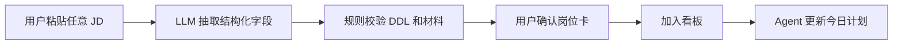
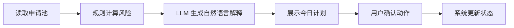

# PRD-JobFind Agent 演进方案：从规则型 Agent 到 LLM Agent

## 1. Summary

本文档定义 JobFind Agent 从首版规则型 Agent 演进到真实 LLM Agent 的产品方案。目标是在不推翻首版产品结构的前提下，引入模型 API，让 Agent 能处理更自由的 JD、生成更自然的建议，并支持更强的求职任务规划。

首版先验证 Agent 的产品逻辑：感知上下文、诊断风险、生成计划、辅助行动。第二阶段再用模型能力增强理解和生成，而不是重新做一个聊天机器人。

## 2. Contacts

| Name | Role | Comment |
|---|---|---|
| 产品负责人 | AI 产品经理候选人 | 负责 Agent 能力边界、演进节奏和评审表达 |
| Codex | 原型开发协作者 | 负责首版规则型 Agent 和后续模型接入改造 |
| 面试评审 | 目标评审方 | 关注 Agent 设计逻辑是否清楚、演进路径是否合理 |
| 大学生求职用户 | 目标用户 | 需要更低录入成本、更清楚的任务计划和更智能的求职建议 |

## 3. Background

### 3.1 Context

JobFind 首版采用规则型 Agent，是为了保证一天内完成高质量可演示作品。规则型 Agent 可以清楚展示产品逻辑：它读取申请池，识别 DDL、材料、面试和沉默风险，再生成今日行动计划。

但规则型 Agent 的限制也很明显：

- 只能处理样例 JD 或格式较稳定的输入。
- 输出建议容易重复。
- 不能很好理解复杂岗位描述。
- 不能根据用户的自然语言问题自由回答。
- 无法生成更个性化的面试准备、跟进话术和复盘建议。

因此第二阶段需要演进为 LLM Agent。这个演进不是为了炫技，而是为了让 Agent 能处理非结构化信息，并提供更自然、更个性化的求职管理能力。

### 3.2 Why Now

首版已经有清晰的信息结构和 Agent 工作流。只要把规则型模块设计成可替换层，后续就可以把部分规则替换为模型能力。

适合优先接入模型的场景是：

- 解析用户粘贴的任意 JD。
- 总结岗位关键要求。
- 生成个性化今日计划说明。
- 生成面试准备清单。
- 生成跟进话术。

不适合马上交给模型的场景是：

- DDL 是否临近。
- 材料是否缺失。
- 阶段是否长期无反馈。
- 是否把岗位推进到下一阶段。

这些更适合继续用确定性规则处理，避免 Agent 判断不稳定。

### 3.3 Migration Principle

演进原则是：模型负责理解和表达，规则负责判断和执行。

也就是说：

- LLM 负责从非结构化文本里抽取信息。
- LLM 负责把建议写得更自然。
- 规则负责计算风险等级。
- 规则负责排序任务优先级。
- 用户确认后，系统才更新状态。

## 4. Objective

### 4.1 Product Objective

把 JobFind Agent 从“规则驱动的可演示 Agent”升级为“模型增强的求职任务代理”，让它能处理真实用户输入，并生成更个性化的求职行动建议。

### 4.2 Why It Matters

规则型 Agent 能证明产品设计逻辑，但 LLM Agent 能进一步证明产品的长期扩展性。

对用户的价值：

- 粘贴任意 JD 都能生成岗位卡。
- 面试准备建议更贴合岗位。
- 跟进话术更自然。
- 周报复盘更像个人求职顾问。
- 用户可以用自然语言问“我今天该先做什么”。

对作品表达的价值：

- 展示从 MVP 到真实 AI 产品的演进意识。
- 展示哪些任务适合模型，哪些任务必须规则化。
- 展示 Agent 的上下文、工具、记忆和执行边界。

### 4.3 Key Results

| Key Result | Measurement |
|---|---|
| KR1：真实 JD 解析可用 | 用户粘贴 5 段不同格式 JD，至少 4 段能抽取公司、岗位、要求、材料和 DDL |
| KR2：Agent 输出更个性化 | 今日计划不只是模板句，而能引用岗位、风险和材料状态 |
| KR3：用户仍然能理解 Agent 为什么这样建议 | 每条建议包含原因、依据和建议动作 |
| KR4：模型失败不影响核心流程 | 模型不可用时，系统仍能回退到规则型 Agent |
| KR5：状态更新保持可控 | 所有推进阶段、绑定材料、标记完成动作都需要用户确认 |

## 5. Market Segment(s)

### 5.1 Primary Segment

首版目标用户不变：正在找实习或校招岗位的大学生，尤其是同时管理 10 个以上岗位的人。

第二阶段更适合服务这些用户：

- 岗位来源更复杂，经常粘贴不同平台 JD。
- 投递方向不止一个，如 AI 产品、产品运营、数据产品。
- 希望获得更具体的面试准备建议。
- 希望让 Agent 用自然语言总结自己的求职进展。

### 5.2 User Constraints

- 用户不愿整理格式，常常直接复制整段 JD。
- 用户希望建议可信，而不是泛泛鼓励。
- 用户不希望 Agent 擅自改状态或发送内容。
- 用户可能没有稳定网络或 API 服务可能失败。

## 6. Value Proposition(s)

### 6.1 Core Value Proposition

LLM Agent 让 JobFind 从“会按规则提醒的看板”升级为“能理解真实岗位信息的求职项目经理”。

### 6.2 Customer Gains

| User Need | LLM Agent Response |
|---|---|
| 我不想整理 JD 格式 | 直接粘贴原文，Agent 自动抽取结构化信息 |
| 我想知道这个岗位看重什么 | Agent 总结核心要求、硬性门槛和关键词 |
| 我明天面试不知道怎么准备 | Agent 根据 JD 和阶段生成准备清单 |
| 我想跟进但不知道怎么说 | Agent 生成礼貌、简短、可编辑的话术 |
| 我想复盘本周求职策略 | Agent 总结渠道、岗位类型和材料版本表现 |

### 6.3 Pain Relievers

- 降低岗位录入成本。
- 降低 JD 阅读成本。
- 降低跟进和面试准备的空白感。
- 降低用户面对大量岗位时的决策压力。

### 6.4 Competitive Difference

竞品常把 AI 用在简历优化或 Cover Letter。JobFind 的差异是把 LLM 放在求职管理流程中：

- 它不是只生成内容。
- 它先理解申请池。
- 它识别任务和风险。
- 它生成可执行计划。
- 它要求用户确认后才推进状态。

## 7. Solution

### 7.1 UX / Prototypes

第二阶段保留首版的“AI 求职作战台 + 看板 + 详情抽屉”结构，只增强 Agent 面板和 JD 录入流程。

#### 7.1.1 Agent Panel

Agent 面板包含 4 个区域：

| Area | Purpose |
|---|---|
| 今日计划 | 展示 Agent 生成的优先任务 |
| 风险依据 | 说明为什么这些任务优先 |
| 可执行动作 | 提供确认按钮，如绑定材料、推进阶段、生成话术 |
| 自然语言追问 | 用户可以问“为什么先处理这个岗位？” |

#### 7.1.2 JD Parsing Flow

#### 7.1.3 Recommendation Flow

### 7.2 Key Features

#### 7.2.1 P0 For LLM Upgrade

| Feature | Description | Acceptance Criteria |
|---|---|---|
| 真实 JD 解析 | 用户粘贴任意 JD，模型抽取字段 | 能生成可编辑岗位卡 |
| 模型增强今日计划 | 模型把规则排序结果转成自然语言计划 | 每条任务包含动作、原因和关联岗位 |
| 面试准备清单 | 根据岗位要求和面试阶段生成准备重点 | 输出 5 到 7 条具体准备项 |
| 跟进话术生成 | 根据岗位状态生成跟进消息 | 输出可复制、可编辑、不过度夸张的话术 |
| 失败回退 | 模型失败时回到规则型 Agent | 核心看板和风险提醒仍然可用 |

#### 7.2.2 P1 For LLM Upgrade

| Feature | Description |
|---|---|
| 自然语言问答 | 用户询问当前求职状态 |
| 周报复盘 | Agent 汇总本周投递、反馈和策略建议 |
| 简历版本建议 | 根据岗位要求推荐更合适的简历版本 |
| 个性化偏好记忆 | 记录用户偏好的岗位方向、城市、渠道 |

#### 7.2.3 Out Of Scope

第二阶段仍不做：

- Agent 自动投递岗位。
- Agent 自动发送邮件。
- Agent 自动修改真实简历文件。
- 多轮自主工具调用循环。
- 长期后台自动运行。

### 7.3 Technology

#### 7.3.0 Tech Stack Decision

图片中推荐的组合是合理的产品化技术栈，但不适合作为一天内面试原型的全部范围。JobFind 采用分阶段技术路线。

| Stage | Tech Stack | Product Reason |
|---|---|---|
| Stage 1：规则型 Agent MVP | Next.js + TypeScript + Tailwind CSS v4 + shadcn/ui + mock data/localStorage | 用最短时间做出完整产品体验，集中展示 Agent 设计逻辑 |
| Stage 2：LLM-Assisted Agent | Next.js + API Route 或 FastAPI + 模型 API | 让模型处理真实 JD、自然语言计划、面试准备和跟进话术 |
| Stage 3：Productized Agent | Next.js + FastAPI + PostgreSQL + Redis | 支持真实账号、长期数据、异步任务、Agent 记忆和服务稳定性 |

技术取舍原则：

- Next.js 适合作为首版主框架，因为页面、组件、状态和轻量接口都能在一个项目内完成。
- Tailwind CSS v4 + shadcn/ui 适合快速生成结构清楚、质量较高的产品界面。
- FastAPI 适合作为第二阶段后端，因为 LLM 调用、prompt 管理、接口校验和异步任务会逐渐变复杂。
- PostgreSQL 适合保存真实用户、岗位、材料、任务、行动记录和 Agent 记忆。
- Redis 适合做缓存、异步任务队列、短期会话状态和模型结果复用，但首版没有必要引入。

核心判断：这套组合是正确的终局技术栈，不是正确的首日技术栈。

#### 7.3.1 Suggested Architecture

| Layer | Responsibility |
|---|---|
| UI Layer | Next.js 首页、看板、详情抽屉、Agent 面板 |
| Application State | 岗位、材料、任务、风险、用户确认动作；首版在前端管理，后续迁移到后端 |
| Rule Engine | DDL、材料缺口、沉默天数、优先级排序；首版可放在前端，后续可迁移到 FastAPI |
| LLM Adapter | JD 抽取、建议生成、话术生成、复盘总结；Stage 2 开始接入 |
| Database Layer | PostgreSQL 保存用户、岗位、材料、任务、行动日志；Stage 3 开始接入 |
| Cache / Queue Layer | Redis 做缓存、短期状态、异步任务队列；Stage 3 开始接入 |
| Fallback Layer | 模型不可用时使用规则型输出 |

#### 7.3.2 Model API Need

首版不需要模型 API。第二阶段需要模型 API，但只需要基础文本能力，不需要复杂多模态或长链工具调用。

最小 API 用法：

- 输入：JD 文本、当前岗位数据、材料状态、用户问题。
- 输出：结构化 JSON 或简短自然语言建议。
- 约束：所有字段都需要前端校验，用户确认后才写入状态。

#### 7.3.3 Prompt Strategy

提示词要把模型限制在求职管理任务中：

- 只根据提供的数据回答。
- 不编造公司、时间、薪资或面试信息。
- 不给法律、签约或职业重大决策的确定性建议。
- 输出结构化字段时必须使用固定 JSON schema。
- 每条建议必须包含依据。

#### 7.3.4 Fallback Strategy

模型失败时：

- JD 解析显示“无法自动识别，请手动确认字段”。
- 今日计划回退到规则型任务排序。
- 面试准备回退到通用准备清单。
- 跟进话术回退到固定模板。

### 7.4 Assumptions

| Assumption | Why It Matters | How To Validate Later |
|---|---|---|
| 用户愿意粘贴 JD 给 Agent 解析 | 决定模型接入价值 | 观察 JD 解析入口使用率 |
| 模型建议比模板更有帮助 | 决定是否值得接 API | 让用户比较模型建议和规则建议 |
| 用户希望保留确认权 | 决定 Agent 是否自动执行 | 访谈用户对“自动改状态”的接受度 |
| 规则和模型混合更稳定 | 决定系统架构 | 记录模型失败和回退次数 |

## 8. Release

### 8.1 Stage 1: Rule-Based Agent MVP

目标：一天内完成可演示作品。

技术栈：

- Next.js。
- TypeScript。
- Tailwind CSS v4。
- shadcn/ui。
- mock data/localStorage。

包含：

- 首页作战台。
- 申请看板。
- 详情抽屉。
- 规则型 Agent 面板。
- 固定样例 JD 解析。
- 风险雷达。
- 材料缺口检查。

不需要模型 API。

不引入：

- FastAPI。
- PostgreSQL。
- Redis。

### 8.2 Stage 2: LLM-Assisted Agent

目标：在首版稳定后，用模型 API 增强输入理解和自然语言输出。

技术栈：

- 继续使用 Next.js 前端。
- 优先用 Next.js API Route 或轻量 FastAPI 封装模型调用。
- 暂时不强制接 PostgreSQL 和 Redis，除非需要真实用户数据保存。

优先接入：

- 任意 JD 解析。
- 今日计划自然语言生成。
- 面试准备清单。
- 跟进话术。

仍然保留：

- 规则型风险判断。
- 用户确认动作。
- 模型失败回退。

### 8.3 Stage 3: Agent Workflow Expansion

目标：让 Agent 更像长期求职项目经理。

技术栈：

- Next.js 负责前端体验。
- FastAPI 负责业务接口、模型调用、prompt 编排和任务服务。
- PostgreSQL 保存真实业务数据和长期记忆。
- Redis 支持缓存、异步任务、短期会话状态和模型结果复用。

可以增加：

- 周报复盘。
- 用户偏好记忆。
- 简历版本推荐。
- 求职策略调整建议。

仍不建议在短期内做全自动投递和自动发送。

### 8.4 API Requirement Decision

结论：

- 一天内完成首版：不需要模型 API。
- 想做增强演示：可以提供模型 API，但只作为加分项。
- 想进入第二阶段：需要模型 API。

如果提供模型 API，最值得做的两个入口是：

1. 解析用户粘贴的真实 JD。
2. 根据当前申请池重新生成今日计划。

这两个入口最能体现 LLM Agent 的价值，也最容易控制范围。

### 8.5 Demo Explanation

面试表达建议：

> 首版我没有直接做复杂 LLM Agent，因为一天内最重要的是验证 Agent 产品逻辑，而不是复刻工程框架。JobFind 先用规则型 Agent 展示感知、诊断、规划和确认执行。后续接入模型 API 后，模型主要增强 JD 理解和自然语言生成，核心风险判断仍由规则负责，这样更稳定，也更符合求职管理这种需要可靠性的场景。

## Appendix: Migration Map

| Stage 1 Rule-Based Agent | Stage 2 LLM Agent |
|---|---|
| 固定样例 JD 解析 | 任意 JD 解析 |
| 规则生成今日任务 | 规则排序 + LLM 解释 |
| 固定跟进模板 | 个性化跟进话术 |
| 通用面试准备 | 基于 JD 的面试准备 |
| 静态复盘卡片 | 模型生成周报复盘 |
| 本地样例数据 | 可扩展到真实用户数据 |

## Appendix: Final Recommendation

当前面试作品应先完成 Stage 1。它更稳、更可控，也更能展示产品经理对范围的判断。

模型 API 可以作为 Stage 2 的演进能力，不应成为首版交付的阻塞项。
